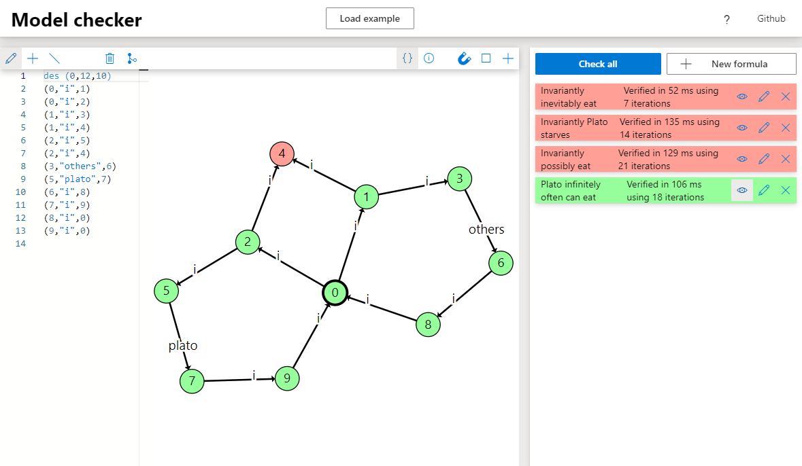

# model-checker

This repository contains a TypeScript implementation of a modal mu-calculus parser, simplifier, and verifier. Two implementations of the verifier are present, one that naively recomputes the fixedpoints every time they are reached, and one called Emerson-Lei which can continue a fixed point where it left off in certain situations.

This project also contains a [visual demo](https://github.com/TarVK/model-checker) that allows for simple Labeled Transition Systems (LTS) to be created or uploaded, and modal mu calculus formulas to be verified on this LTS.


This model checker was created as an assignment for the 2IMF35 Algorithms for model checking course taught at the [TU/e](https://www.tue.nl/en/). The course only required us to make a very simple parser, implement the two verification algorithms, and create a command line interface. I however decided to reuse some code of my other projects and create a visual web-interface, and add some extended syntax and means of translating formulas in this syntax to equivalent formulas in the original syntax.

## Syntax

The verification algorithms operate on mu-calculus formulas which are constructed in accordance to the following syntax:

```
f,g ::= false | true | (f) | f && g | f || g | [a]f | <a>f | mu X.f | nu X.f | X
```

Here `a` ranges over all actions present in your LTS, and `X` ranges over all valid variable names.
Informally, the semantics of each of these constructs can be explained in terms of (not) including a state `s` of an LTS as follows:

-   `false`: never includes state `s`
-   `true`: always includes state `s`
-   `(f)`: includes state `s` if `f` includes state `s`
-   `f && g`: includes state `s` if `f` includes state `s` _and_ `g` includes state `s`
-   `f || g`: includes state `s` if `f` includes state `s` _or_ `g` includes state `s`
-   `[a]f`: includes state `s` if for every transition with label `a` from `s` to some state `q`, `f` includes state `q`
-   `<a>f`: includes state `s` if there exists a transition with label `a` from `s` to some state `q` where `f` includes state `q`
-   `mu X.f`: includes state `s` if formula `f` includes `s`, where only a finite sequence of `X` variables was used
-   `nu X.f`: includes state `s` if formula `f` includes `s`, where possibly an _infinite_ sequence of `X` variables is used
-   `X`: includes state `s` if the fixed point (`mu` or `nu`) that binds the variable `X` includes `s`
    A formula holds for LTS, if it holds for the initial state of the LTS.

Most of these constructs are rather intuitive, except for the `mu` and `nu` operators. These represent fixed point operators. This is essentially a recursive function, where we know that a fixed point can be reached in the recursion. `mu` looks for the smallest fixed point, while `nu` looks for the largest fixed point.

Consider for instance formula `mu X. <a>X`. This formula will represent an empty set of states no matter what the LTS is, because even the empty set fulfills the equation that follows from this: `X = <a>X`. If `X` contains no states, then trivially the set of states that can reach the empty set of states using an `a` transition, is also empty. However depending on the LTS in question, `nu X. <a>X` may contain some states. If we have a loop of states: `1`, `2`, and `3`; each with an a transition to the next state: `1 -a> 2`, `2 -a> 3`, `3 -a> 1`; then this set can be included in the maximal fixed point. Because indeed if for instance `X = {1,2,3}` the set of states that have outgoing `a` transitions to any element in `X` contains at least all elements of `X` itself. So `nu X. <a>X` will contain these 3 states, and potentially more. When thinking of `X` as a sort of recursion, the maximal fixed point essentially allows for infinite recurision, cyclic paths, while the minimal fixed point does not allow this.

### Extended syntax

The algorithms only know how to deal with constructs from the original syntax, but this syntax can be cumbersome to work with in many cases. For that reason, I extended the syntax with some constructs in accordance to those present in [mCRL2](https://www.mcrl2.org/). This allows users to more intuitively and consisely write formulas, but it does not extend expressive power since these formulas are all translated to equivalent formulas in the original syntax.

The formulas can be constructed according to the following grammar:

```
f,g ::= false | true | (f) | !f | f && g | f || g | f => g | [r]f | <r>f | mu X.f | nu X.f | X
r,s ::= A | (r) | r + s | r . s | r* | r+
A,B ::= false | true | a | (A) | !A | A && B | A || B
```

Here `a` ranges over all actions present in your LTS, and `X` ranges over all valid variable names.
Informally, the semantics of each of the base formula constructs can still be explained in terms of (not) including a state `s` of an LTS as follows:

-   `false`: never includes state `s`
-   `true`: always includes state `s`
-   `(f)`: includes state `s` if `f` includes state `s`
-   `!f`: includes state `s` if `f` does _not_ include state `s`
-   `f && g`: includes state `s` if `f` includes state `s` _and_ `g` includes state `s`
-   `f || g`: includes state `s` if `f` includes state `s` _or_ `g` includes state `s`
-   `f => g`: includes state `s` if whenever `f` includes state `s`, `g` also includes state `s`
-   `[r]f`: includes state `s` if for every path according to `r` from `s` to some state `q`, `f` includes state `q`
-   `<r>f`: includes state `s` if there exists some path according to `r` from `s` to some state `q` where `f` includes state `q`
-   `mu X.f`: includes state `s` if formula `f` includes `s`, where only a finite sequence of `X` variables was used
-   `nu X.f`: includes state `s` if formula `f` includes `s`, where possibly an _infinite_ sequence of `X` variables is used
-   `X`: includes state `s` if the fixed point (`mu` or `nu`) that binds the variable `X` includes `s`

Next we have to express what paths an expression `r` represents. We informally define whether an expression `r` includes path `p` for each construct:

-   `A`: includes `p` if `p` consists of a single action, which is contained in set `A`
-   `(r)`: includes `p` if `r` includes `p`
-   `r + s`: includes `p` if `r` includes `p` or `s` includes `p`
-   `r . s`: includes `p` if `r` includes a start sub-path of `p`, and `s` includes the remainder of the path of `p`
-   `r*`: includes `p` if `p` can be split into _0_ or more sub-paths that each are included in `r`
-   `r+`: includes `p` if `p` can be split into _1_ or more sub-paths that each are included in `r`

Finally we have to express whether an action `ac` is present in a set of actions:

-   `false`: never includes `ac`
-   `true`: always includes `ac` (if it appears somewhere in the LTS)
-   `a`: includes `ac` if `ac == a`
-   `(A)`: includes `ac` if `A` includes `ac`
-   `!A`: includes `ac` if `A` does not include `ac`
-   `A && B`: includes `ac` if `A` includes `ac` _and_ `B` includes `ac`
-   `A || B`: includes `ac` if `A` includes `ac` _or_ `B` includes `ac`

Using this syntax, we can for instance write prefix `[true*]` to express that some property should hold in all reachable states. We can for instance write `[true*]<a>true` to express that every reachable state should have an outgoing `a` transition.
This formula can then automatically be translated to one in the original syntax, resulting in E.g: `nu A. ((([a]A && [b]A) && [c]A) && <a>true)`. The exact translation however depends on what actions are available in the LTS that's being analyzed.

The code responsible for this translation step can be found [here](https://github.com/TarVK/model-checker/blob/main/src/formula/getReducedAST.ts).

## Structure

The code in this repository contains several exports, such that it could be used as a library.
These exports include:

-   `ltsParser`: used to parse a textual LTS into a js representation
-   `createLTS`: used to preprocess a parsed LTS to more efficiently verify properties on it
-   `formulaParser`: used to parse a textual (extended) modal mu calculus formula into an AST
-   `getReducedAST`: used to transform the extended modal mu calculus AST into an equivalent simple modal mu calculus AST (needed for verification)
-   `getFormulaWithUniqueVariables`: used to transform a simple modal mu calculus AST with possibly duplicate variable names into one with unique variable names (needed for verification)
-   `getFreeVariables`, `getDepth`, `getAlternationDepth`, `getDependentAlternationDepth`, `getFormulaText`: helper functions used to extract data from simple modal mu calculus formula
-   `naiveVerify`: used to verify whether a simple modal mu calculus formula (with unique variables) holds for a preprocessed LTS
-   `emersonLeiVerify`: used to more efficiently verify whether a simple modal mu calculus formula (with unique variables) holds for a preprocessed LTS

## Building

Building the library requires [node.js](https://nodejs.org/en/) to be installed.

To install the remaining dependencies of this project, open a terminal at the root of this project and run:

```
npm install
```

After installation is done, the project can be build in watch mode using:

```
npm run dev
```

Or one can build just once after all changes are made using:

```
npm run build
```

In order to quickly see the effects of changes, build the code in watch mode and run the demo locally (See the readme in the demo folder for instructions).
